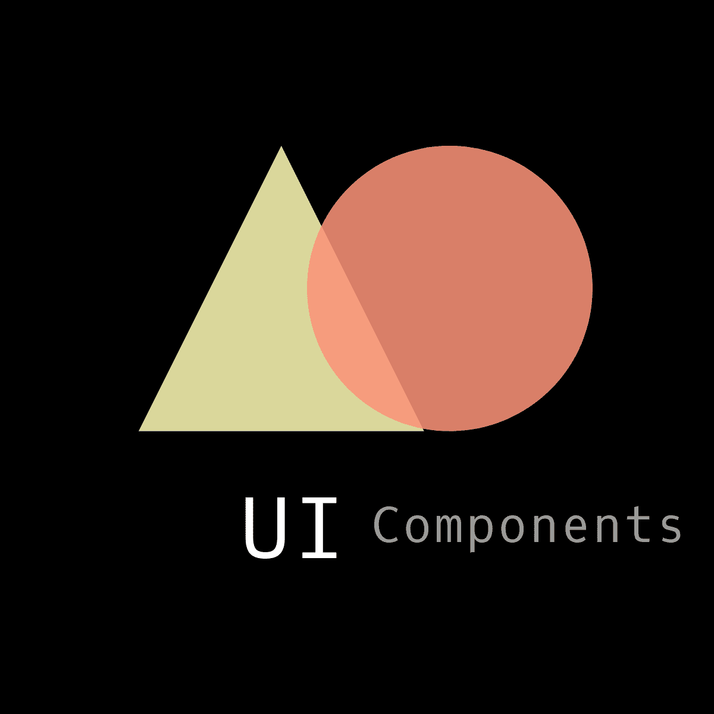
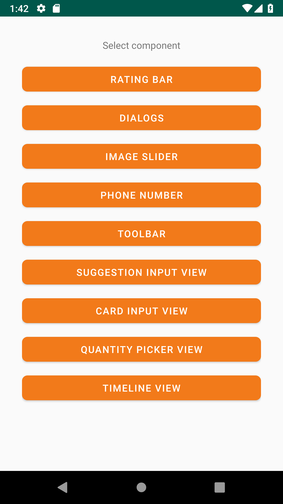
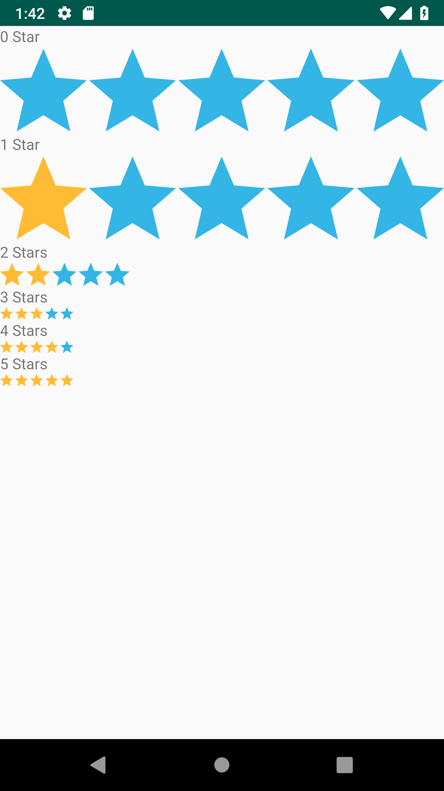
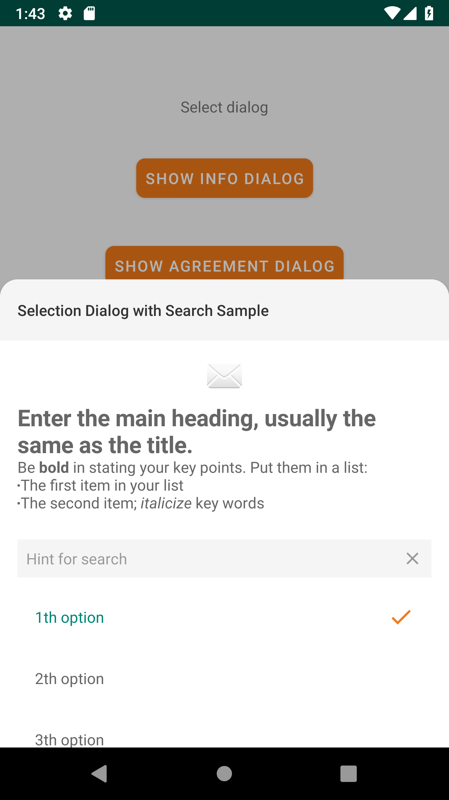
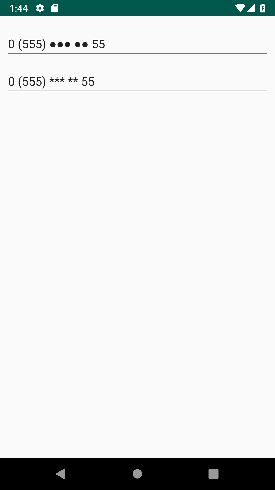
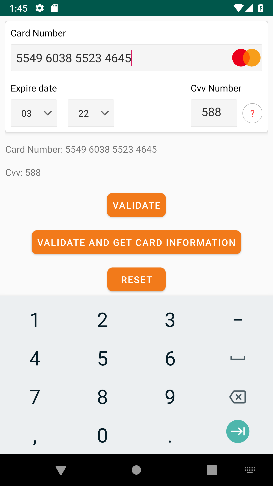
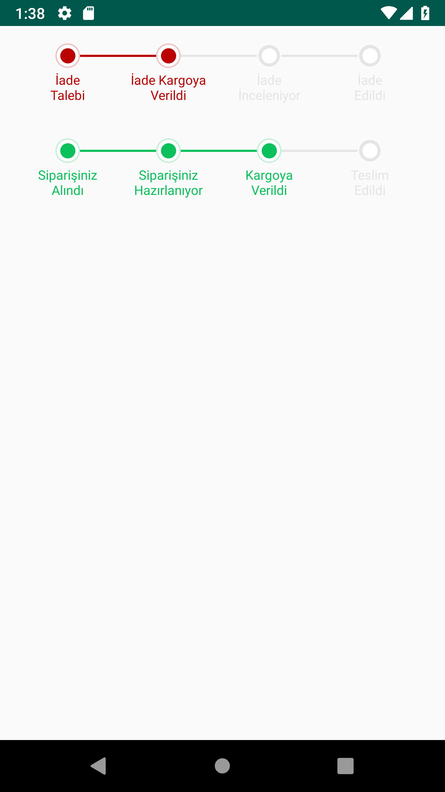
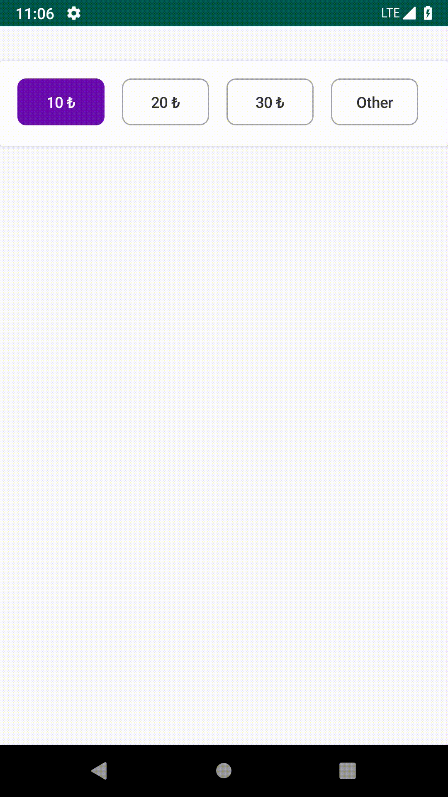
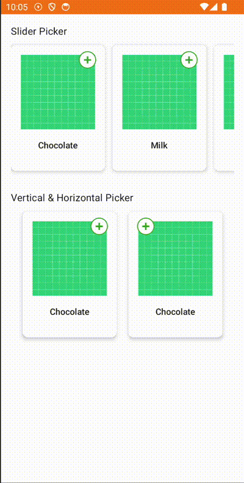
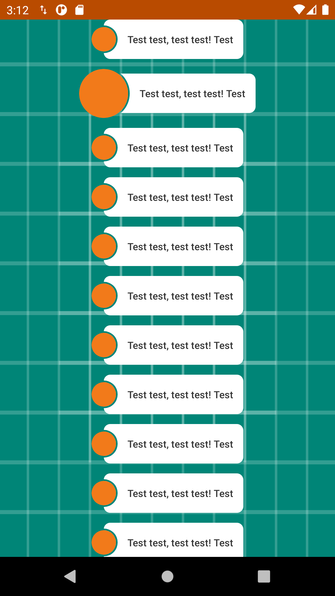

UI Components for Android by Trendyol Android team.

UI Components includes several custom views for Android platform to make developers life easier!

 
 
 
 

## Why?

[Trendyol](https://play.google.com/store/apps/details?id=trendyol.com) Android application, we are using several custom view implementations that can be useful for other apps.

## Components

* [Rating Bar](libraries/rating-bar): **RatingBarView**, easy to use and customizable rating view.
* [Rating Bar Compose](libraries/rating-bar-compose): **RatingBar**, easy to use and customizable ratingBar for compose.
* [Dialogs](libraries/dialogs): **Dialogs** is collection of BottomSheetDialogs to present user an info, agreement or list.
* [Toolbar](libraries/toolbar): **Toolbar** is customizable and easy to use component.
* [SuggestionInputView](libraries/suggestion-input-view): **SuggestionInputView** allows selecting pre-selected options or entering a custom option.
* [CardInputView](libraries/card-input-view): **CardInputView** for get debit/credit card inputs and validations.
* [QuantityPickerView](libraries/quantity-picker-view): **QuantityPickerView** for picking quantity easily without keyboard input.
* [QuantityPickerCompose](libraries/quantity-picker-compose): **QuantityPickerView** for picking quantity easily without keyboard input.
* [TimelineView](libraries/timeline-view): **TimelineView** for creating a timeline and show actions on it.
* [TimelineViewCompose](libraries/timeline-view-compose): **TimelineView** for creating a timeline for compose and show actions on it.
* [FitOptionMessage](libraries/fit-option-message-view): **FitOptionMessageView** for displaying text views with clipped imageviews.

License
-------

Copyright 2022 Trendyol.com

Licensed under the Apache License, Version 2.0 (the "License");
you may not use this file except in compliance with the License.
You may obtain a copy of the License at

http://www.apache.org/licenses/LICENSE-2.0

Unless required by applicable law or agreed to in writing, software
distributed under the License is distributed on an "AS IS" BASIS,
WITHOUT WARRANTIES OR CONDITIONS OF ANY KIND, either express or implied.
See the License for the specific language governing permissions and
limitations under the License.

