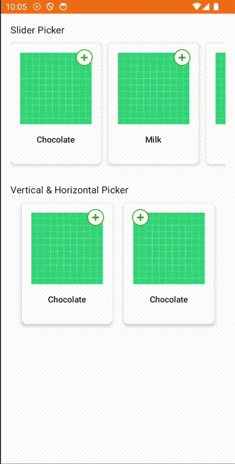

quantityPickerComposeVersion= **quantity-picker-compose-1.0.1** [](https://opensource.org/licenses/Apache-2.0)

## QuantityPicker

QuantityPicker is compose component to add/remove anything



## Installation

- To implement **QuantityPicker** to your Android project via Gradle, you need to add JitPack repository to your root/project level build.gradle.

```gradle
allprojects {  
    repositories { ... maven { url 'https://jitpack.io' } }
}
```

- After adding JitPack repository, you can add **QuantityPicker** dependency to your app/module level build.gradle.

```gradle
dependencies {
   implementation "com.github.Trendyol.android-ui-components:quantity-picker-compose:$quantityPickerComposeVersion"
 }
```

## Usage

You can add **QuantityPicker** wherever you want with your modifier

| Attribute           | Type                    | Description                                                                 |
| ------------------- | ----------------------- | --------------------------------------------------------------------------- |
| modifier            | Modifier                | Compose modifier for QuantityPicker                                         |
| direction           | QuantityPickerDirection | Picker Direction Vertical or Horizontal                                     |
| quantityTextShape   | QuantityPickerShape     | Compose shape for quantity text.                                            |
| quantityPickerShape | QuantityPickerShape     | Background of all view also defines border if it is not null                |
| textStyle           | TextStyle               | Text style for quantity text                                                |
| addIconResId        | Int                     | Drawable for add button                                                     |
| subtractIconResId   | Int                     | Drawable for subtract button                                                |
| removeIconResId     | Int                     | Drawable for remove button. Visible if it is null and current quantity is 1 |
| iconTintColor       | Color                   | Tint Color for Icons                                                        |
| quantityData        | QuantityData            | Quantity values. It has min,max,current and postfix                         |
| showLoading         | Boolean                 | Loading state                                                               |
| progressColor       | Color                   | Color for loading progress indicator                                        |
| onAddClick          | (() -> Unit)            | Listener for add button clicks                                              |
| onSubtractClick     | (() -> Unit)            | Listener for subtract clicks                                                |

## Implementation

If you don't need any customization

```kotlin
QuantityPicker(
    modifier = modifier,
    quantityData = quantityData,
    showLoading = isLoading,
    onAddClick = { },
    onSubtractClick = { }
)
```

If you need background or custom modifier for quantity text and all view

```kotlin
QuantityPicker(
    textStyle = Typography.body2,
    quantityData = quantityData,
    addIconResId = R.drawable.ic_plus,
    subtractIconResId = R.drawable.ic_minus,
    removeIconResId = R.drawable.ic_remove,
    iconTintColor = Color.White, // QuantityPickerDefaults.defaultColor
    quantityPickerShape = QuantityPickerShape( // QuantityPickerDefaults.quantityShape,
        shape = RoundedCornerShape(50),
        borderColor = MyQuantityPickerPrimaryColor,
        borderWidth = 1.dp
    ),
    quantityTextShape = QuantityPickerShape( // QuantityPickerDefaults.quantityTextShape
        shape = RoundedCornerShape(50),
        borderColor = MyQuantityPickerPrimaryColor,
        borderWidth = 1.dp
    ),
    showLoading = isLoading,
    progressColor = MyQuantityPickerPrimaryColor, // QuantityPickerDefaults.defaultColor
    onAddClick = { },
    onSubtractClick = { }
)
```

# Contributors

This library is maintained mainly by Trendyol Android Team members but also other Android lovers contributes.

# License

```
Copyright 2023 Trendyol.com    Licensed under the Apache License, Version 2.0 (the "License");    you may not use this file except in compliance with the License.    You may obtain a copy of the License at  
   http://www.apache.org/licenses/LICENSE-2.0  
Unless required by applicable law or agreed to in writing, software    distributed under the License is distributed on an "AS IS" BASIS,    WITHOUT WARRANTIES OR CONDITIONS OF ANY KIND, either express or implied.    See the License for the specific language governing permissions and    limitations under the License.
```

