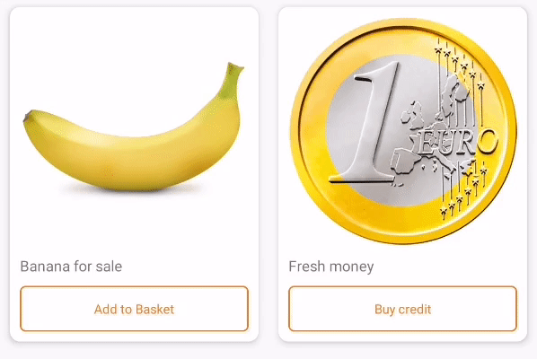

$quantityPickerViewVersion = quantity-picker-view-1.2.4 [](https://opensource.org/licenses/Apache-2.0)

## QuantityPickerView
QuantityPickerView is component for add/remove

## Installation
  - To implement **QuantityPickerView** to your Android project via Gradle, you need to add JitPack repository to your root/project level build.gradle.
```gradle
allprojects {  
 repositories { ... maven { url 'https://jitpack.io' } }}  
```
 - After adding JitPack repository, you can add **QuantityPickerView** dependency to your app/module level build.gradle.
```gradle
dependencies {  
 implementation "com.github.Trendyol.android-ui-components:quantity-picker-view:$quantityPickerViewVersion"}
```
:warning: To use **QuantityPickerView**, you have to enable dataBinding from your project's `build.gradle`.

## Usage
You can inflate **QuantityPickerView** via XML or programmatically. View can be configurable either in XML or setting a *QuantityPickerViewState*.

Default colors will be set from your theme's `colorAccent` and `colorPrimary` attributes.

To set programmatically, you can call `QuantityPickerView.setQuantityPickerViewState(QuantityPickerViewState)`.

:warning: You need to provide all properties if you wish to set programmatically via providing QuantityPickerViewState.

| Attribute |  ViewState Field | Description | Default Value |
| ------------- | ------------- | ------------- | ------------- |
| qpv_text | text | Text to show when currentQuantity is 0. | "" |
| qpv_textColor | textColor |  Text color. | `colorAccent` |
| qpv_textSize | textSize | Text size. Should be pixel value if programmatically set. | `12sp` |
| qpv_textStyle | textStyle | Text style: normal(0), bold(1) or italic(2) Note: Default text font is Roboto Medium. | `normal` |
| qpv_quantityTextColor | quantityTextColor | Quantity text color. | `colorPrimary` |
| qpv_quantityTextSize | quantityTextSize | Quantity text size. Should be pixel value if programmatically set.  | `14sp |
| qpv_quantityTextStyle | quantityTextStyle | Quantity text style: normal(0), bold(1) or italic(2) Note: Default text font is Roboto Medium. | `normal` |
| qpv_currentQuantity | currentQuantity | Quantity value, optional. | 0 |
| qpv_maxQuantity | maxQuantity | Maximum quantity value, optional. |  |
| qpv_minQuantity | minQuantity | Minimum quantity value, optional. |  |
| android:progressTint | progressTintColor | Tint for loading ProgressBar. | `colorAccent` |
| android:background | backgroundDrawable | Background to all view. | [qpv_shape_default_background.xml](src/main/res/drawable/qpv_shape_default_background.xml) |
| qpv_removeIcon | removeIconDrawable | Icon for remove, will be only visible when currentQuantity is 1. | [qpv_ic_default_remove.xml](src/main/res/drawable/qpv_ic_default_remove.xml) |
| qpv_addIcon | addIconDrawable | Icon for add, will be visible when currentQuantity is 1 or more. | [qpv_ic_default_add.xml](src/main/res/drawable/qpv_ic_default_add.xml) |
| qpv_disabledAddIcon | disabledAddIconDrawable | Icon for add button disabled state, will be visible when maxQuantity is set and currentQuantity is equal to maxQuantity. | [qpv_ic_default_add.xml](src/main/res/drawable/qpv_ic_default_add.xml) |
| qpv_subtractIcon | subtractIconDrawable | Icon for subtract, will be visible when currentQuantity is 2 or more. | [qpv_ic_default_subtract.xml](src/main/res/drawable/qpv_ic_default_subtract.xml) |
| qpv_disabledSubtractIcon | disabledSubtractIconDrawable | Icon for subtract button disabled state, will be visible when minQuantity is set and currentQuantity is equal to minQuantity. | [qpv_ic_default_add.xml](src/main/res/drawable/qpv_ic_default_add.xml) |
| qpv_quantityBackground | quantityBackgroundDrawable | Background for quantity text. | `transparent` |
| qpv_orientation | orientation | Determines view orientation. | 'horizontal` |
| qpv_collapsible | collapsible | Determines if view is collapsible. | 'false' |
| qpv_buttonVerticalPadding | buttonVerticalPadding | padding for buttons vertically. | `8dp` |
| qpv_buttonHorizontalPadding | buttonHorizontalPadding | padding for buttons horizontally. | `8dp` |
| qpv_progressVerticalPadding | progressVerticalPadding | padding for progress bar vertically if `orientation` is `horizontal`, else horizontal padding. | `2dp` |
| qpv_quantityBackgroundVerticalPadding | quantityBackgroundVerticalPadding | padding for quantity background vertically if `orientation` is `horizontal`, else horizontal padding. | `2dp` |

# Public methods

| Method Name |  Parameter | Description |
| ------------- | ------------- | ------------- |
| setQuantityPickerViewState | viewState :QuantityPickerViewState | To set QuantityPickerViewState programmatically. |
| setQuantity | quantity: Int | To set quantity immediately. |
| setMaxQuantity | maxQuantity: Int | To set maxQuantity immediately. |
| setMinQuantity | minQuantity: Int | To set minQuantity immediately. |
| stopLoading |  | To stop current loading.|
| reset |  | To stop loading and set currentQuantity to 0. |
| incrementQuantityBy | quantity | increments current total quantity by quantity parameter

## Listeners
To get updates on **QuantityPickerView** you need to set this listeners:

| Listener | Data | Return | Information |
| ------------- | ------------- | ------------- | ------------- |
| onAddClicked | quantityAfterAdd: Int | showLoading: Boolean | Will be triggered when user clicks text when currentQuantity 0 or add button when currentQuantity bigger than 0. |
| onSubtractClicked | quantityAfterSubtract: Int | showLoading: Boolean | Wil be triggered when user clicks remove or subtract icon. |
| onQuantityTextClicked | quantity: Int |  | Wil be triggered when user clicks text |
| expansionListener | expansionState: ExpansionState | | Will be triggered after expansion state is changed. |

## Implementation

From XML, you can use attributes like below:

```xml
<com.trendyol.uicomponents.quantitypickerview.QuantityPickerView
    android:id="@+id/quantity_picker_view"
    android:layout_width="match_parent"
    android:layout_height="36dp"
    app:qpv_currentQuantity="1"
    app:qpv_maxQuantity="10"
    app:qpv_minQuantity="1"
    app:qpv_quantityBackground="@drawable/qpv_shape_default_background"
    app:qpv_quantityTextSize="14sp"
    app:qpv_text="Add to Cart"
    app:qpv_textSize="12sp" />
```

To set *QuantityPickerViewState* programmatically:

```kotlin
val viewState = QuantityPickerViewState(
    text = "Fresh Money",
    textSize = asSP(12),
    quantityTextSize = asSP(14),
    backgroundDrawable = drawable(R.drawable.qpv_shape_default_background),
    removeIconDrawable = drawable(R.drawable.qpv_ic_default_remove),
    subtractIconDrawable = drawable(R.drawable.qpv_ic_default_subtract),
    addIconDrawable = drawable(R.drawable.qpv_ic_default_add),
    quantityBackgroundDrawable = drawable(R.drawable.qpv_shape_default_background),
    textColor = themeColor(R.attr.colorAccent),
    progressTintColor = themeColor(R.attr.colorAccent),
    quantityTextColor = themeColor(R.attr.colorPrimary)
)
        
findViewById<QuantityPickerView>(R.id.quantity_picker_view).setQuantityPickerViewState(viewState)
```

## Contributors
This library is maintained mainly by Trendyol Android Team members but also other Android lovers contributes.

We developed this component for our needs, there is lots of improvements need to be implemented.

# License
    Copyright 2021 Trendyol.com

    Licensed under the Apache License, Version 2.0 (the "License");
    you may not use this file except in compliance with the License.
    You may obtain a copy of the License at

       http://www.apache.org/licenses/LICENSE-2.0

    Unless required by applicable law or agreed to in writing, software
    distributed under the License is distributed on an "AS IS" BASIS,
    WITHOUT WARRANTIES OR CONDITIONS OF ANY KIND, either express or implied.
    See the License for the specific language governing permissions and
    limitations under the License.
