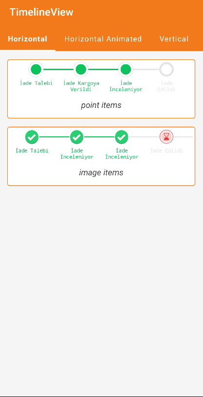
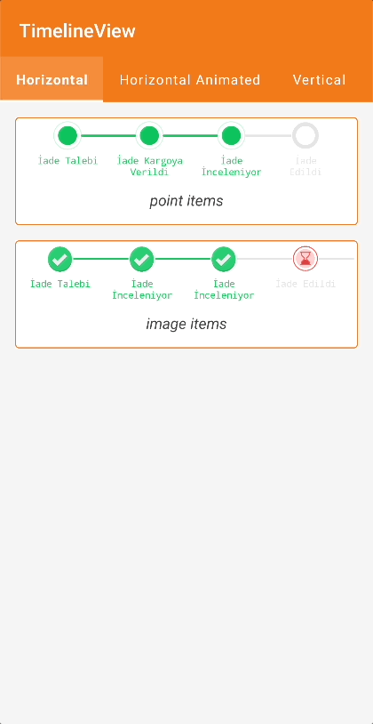
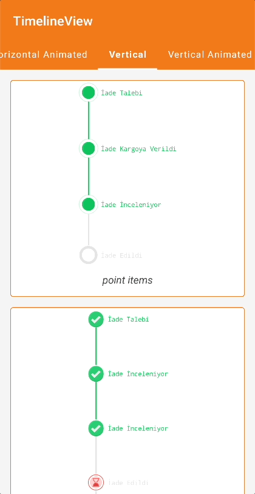
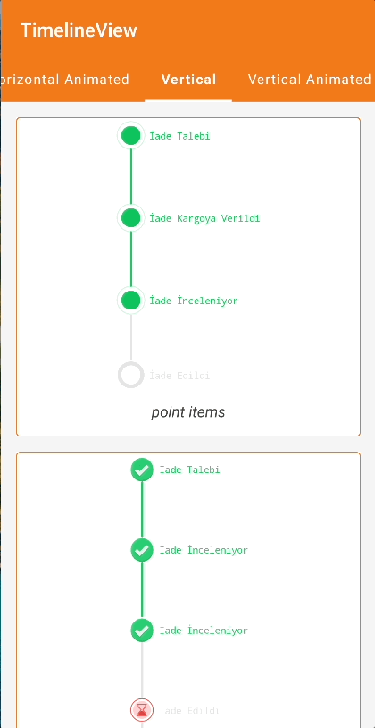

|  |  |  |  |
|:-----------------------------------------------------------------------------------------------------------------------------:|:--------------------------------------------------------------------------------------------------:|:---------------------------------------------------------------------------------------:|:------------------------------------------------------------------------------------------------:|
|                                                     **Horizontal Simple**                                                     |                                      **Horizontal Animated**                                       |                                   **Vertical Simple**                                   |                                      **Vertical Animated**                                       |

timelineViewComposeVersion = **timeline-view-compose-1.0** [](https://opensource.org/licenses/Apache-2.0)

# TimelineView

TimelineView creates a timeline and shows actions over time. 

# HorizontalTimelineWithIndexText

HorizontalTimelineWithIndexText creates a timeline with points at their midpoints displaying their respective indexes. 
The line width is automatically calculated and centered horizontally to fit the screen. It can contain any number of steps.

# Installation

- To implement **TimelineView** to your Android project via Gradle, you need to add JitPack repository to your root build.gradle.  

```gradle
allprojects {  
    repositories {      
      ...
      maven { url 'https://jitpack.io' } 
   }
}  
```

- After adding JitPack repository, you can add **TimelineView** dependency to your app level build.gradle.  

```gradle
dependencies {  
    implementation "com.github.Trendyol.android-ui-components:timeline-view-compose:$timelineViewComposeVersion"}  
```

# Usage

➡️ To start using TimelineView, `TimelineView` composable can be used like this

*To customize each item, you can modify pointConfig and lineConfig.*

- Sample LineConfig

```kotlin
   val lineConfig = LineConfig(
            strokeCap = StrokeCap.Butt,
            color = Color.Gray,
            size = TimelineViewDefaults.LineSize,
            thickness = TimelineViewDefaults.LineThickness,
            lineType = LineType.Solid,
            animation = LineAnimation(
                initialValue = 0f,
                durationMillis = 1000,
                targetColor = Color.Green,
                targetValue = 1f
            ),
        )
```

- Sample PointConfig

```kotlin
val pointConfig = PointConfig(
            outSideColor = Color.White,
            borderWidth = TimelineViewDefaults.BorderWidth,
            insideColor = Color.Green,
            size = 32.dp,
            animation = PointAnimation(
                initialValue = 0.5f,
                targetValue = 1f,
                startDelay = 0,
                animationSpec = infiniteRepeatable(
                    repeatMode = RepeatMode.Reverse,
                    animation = tween(
                        durationMillis = 1000,
                        easing = LinearEasing,
                    ),
                )
            )
        )
```

- Sample Model for TimelineView

```kotlin
val timelineItems = listOf(
    TimelineItem.Point(
        text = "Step Name",
        textStyle = MaterialTheme.typography.body1,
        pointConfig = pointConfig,
        lineConfig = lineConfig,
    )
)
```

```kotlin
    TimelineView(
        modifier = Modifier.fillMaxWidth(),
        items = timelineItems,
        orientation = TimelineOrientation.HORIZONTAL,
        onClick = {}
    )
```

➡️ To start using HorizontalTimelineWithIndexText, `HorizontalTimelineWithIndexText` composable can be used like this

```kotlin
    HorizontalTimelineWithIndexTextView(
        modifier = Modifier.padding(horizontal = 16.dp),
        items = createHorizontalWithIndexTimelineItems(),
    )
```

# Paremeters

#### Models

---

###### PointConfig

| Parameter Name | Type           | Description         |
|----------------|----------------|---------------------|
| outSideColor   | Color          | To set outSideColor |
| borderWidth    | Dp             | To set borderWidth  |
| insideColor    | Color          | To set insideColor  |
| size           | Dp             | To set point size   |
| animation      | PointAnimation | To set animation    |

###### PointAnimation

| Parameter Name | Type                   | Description                       |
|----------------|------------------------|-----------------------------------|
| initialValue   | Float                  | To set initial value of animation |
| targetValue    | Float                  | To set target value of animation  |
| startDelay     | Int                    | To set start delay of animation   |
| animationSpec  | InfiniteRepeatableSpec | To set animationSpec of animation |

###### LineConfig

| Parameter Name | Type      | Description                                                     |
|----------------|-----------|-----------------------------------------------------------------|
| strokeCap      | StrokeCap | To set strokeCap of line                                        |
| color          | Color     | To set color of line                                            |
| size           | Dp        | To set size of line                                             |
| thickness      | Dp        | To set thickness of line                                        |
| lineType       | LineType  | To set lineType, it accepts LineType.Solid or LineType.Dashed() |

###### LineAnimation

| Parameter Name | Type  | Description                                                     |
|----------------|-------|-----------------------------------------------------------------|
| initialValue   | Float | To set initialValue                                             |
| durationMillis | Int   | To set durationMillis of line animation                         |
| targetColor    | Color | To set targetColor when it will be changed during the animation |
| targetValue    | Float | To set targetValue                                              |

###### ImageConfig

| Parameter Name | Type           | Description                 |
|----------------|----------------|-----------------------------|
| imageUrl       | String         | To set imageUrl             |
| placeholder    | Painter        | To set placeholder          |
| borderWidth    | Dp             | To set borderWidth of image |
| size           | Dp             | To set size                 |
| animation      | PointAnimation | To set animation            |

###### PointShadowConfig

| Parameter Name | Type  | Description                 |
|----------------|-------|-----------------------------|
| elevation      | Int   | To set imageUrl             |
| color          | Color | To set placeholder          |
| alpha          | Float | To set borderWidth of image |
| radius         | Float | To set size                 |

#### Item Types

---

###### TimelineItem.Point

| Parameter Name    | Type              | Description          |
|-------------------|-------------------|----------------------|
| text              | String            | To set text          |
| textStyle         | TextStyle         | To set textStyle     |
| pointConfig       | PointConfig       | To set pointConfig   |
| contentMargin     | Dp                | To set contentMargin |
| lineConfig        | LineConfig        | To set lineConfig    |
| pointShadowConfig | PointShadowConfig | To set shadow        |

###### TimelineItem.Image

| Parameter Name          | Type        | Description                    |
|-------------------------|-------------|--------------------------------|
| text                    | String      | To set text                    |
| textStyle               | TextStyle   | To set textStyle of text       |
| imageContentDescription | String      | To set imageContentDescription |
| imageConfig             | ImageConfig | To set imageConfig             |
| lineConfig              | LineConfig  | To set lineConfig              |

###### TimelineItem.PointWithIndex

| Parameter Name    | Type              | Description          |
|-------------------|-------------------|----------------------|
| text              | String            | To set text          |
| textStyle         | TextStyle         | To set textStyle     |
| pointConfig       | PointConfig       | To set pointConfig   |
| contentMargin     | Dp                | To set contentMargin |
| lineConfig        | LineConfig        | To set lineConfig    |
| pointShadowConfig | PointShadowConfig | To set shadow        |
| indexTextStyle    | TextStyle         | To set index style   |

# Contributors

This library is maintained mainly by Trendyol Android Team members but also other Android lovers contributes.  

# License

    Copyright 2023 Trendyol.com  
    Licensed under the Apache License, Version 2.0 (the "License");    you may not use this file except in compliance with the License.    You may obtain a copy of the License at  
       http://www.apache.org/licenses/LICENSE-2.0  
    Unless required by applicable law or agreed to in writing, software    distributed under the License is distributed on an "AS IS" BASIS,    WITHOUT WARRANTIES OR CONDITIONS OF ANY KIND, either express or implied.    See the License for the specific language governing permissions and    limitations under the License.
